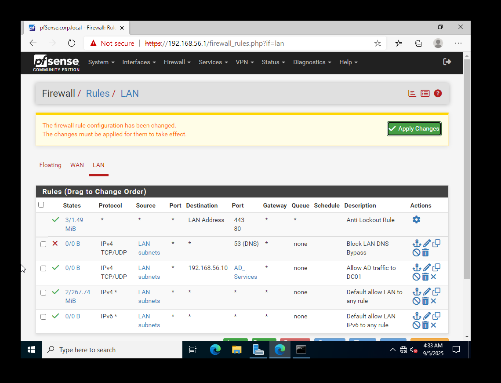
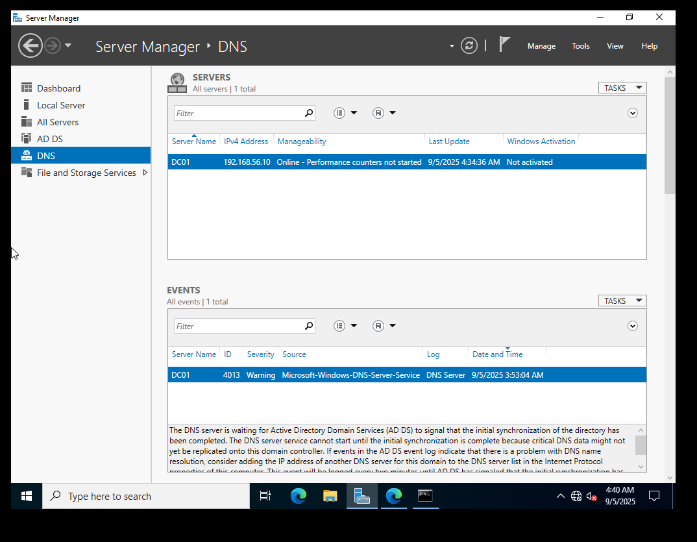

# 🔐 pfSense Firewall Integration with Active Directory Lab

## 📖 Overview
This lab demonstrates how to integrate **pfSense** into an existing **Active Directory (AD) environment** using VMware Workstation.  
The setup simulates a real-world corporate network where pfSense acts as the firewall and DNS forwarder, while AD Domain Controller (DC01) handles internal domain services.

Key outcomes:
- pfSense installed and configured with WAN, LAN, and firewall rules.
- Active Directory clients forced to use the Domain Controller for DNS resolution.
- Correct DNS forwarding chain established: **Client → DC01 → pfSense → Internet**.
- Firewall rules created to explicitly allow only required AD services and block DNS bypass attempts.

---

## 🖥️ Lab Topology

```
[Internet]
    │
   WAN (DHCP)
    │
[pfSense Firewall]
   LAN: 192.168.56.1/24
    │
 ┌───────────────┬───────────────┐
 │                               │
[DC01 - Domain Controller]   [Client01 - Windows 10]
IP: 192.168.56.10            DHCP/Static: 192.168.56.x
DNS: 192.168.56.10           DNS: 192.168.56.10
```

---

## ⚙️ Step 1: pfSense Installation

1. **Created pfSense VM** with three adapters in VMware Workstation:
   - **WAN** → NAT/Bridged (connects pfSense to Internet).
   - **LAN** → Host-only (VMnet1, lab subnet 192.168.56.0/24).
   - **OPT1** → reserved for future lab use.

2. **Assigned interfaces** during pfSense setup:
   - `em0` → WAN (DHCP assigned by host).
   - `em1` → LAN (`192.168.56.1/24`).
   - `em2` → OPT1 (currently unused).

  
  

3. Completed the **pfSense Setup Wizard**:
   - Hostname: `pfsense`
   - Domain: `corp.local`
   - Primary DNS: `192.168.56.10` (DC01)
   - Secondary DNS: `8.8.8.8`
   - Disabled "Allow DNS override".


---

## 🔒 Step 2: Firewall Alias for AD Services

To avoid creating multiple rules for individual AD service ports, an **Alias** was created.

1. Navigate to: **Firewall → Aliases → Ports → Add**  
2. Created alias: `AD_Services`  
   - Description: *Active Directory required ports*  
   - Added ports:  
     - `53` (TCP/UDP) – DNS  
     - `88` (TCP/UDP) – Kerberos  
     - `135` (TCP) – RPC  
     - `389` (TCP/UDP) – LDAP  
     - `445` (TCP) – SMB  
     - `464` (TCP/UDP) – Kerberos password change  
     - `123` (UDP) – NTP  

  

 
---

## 🔐 Step 3: Firewall Rules

### Rules Configured on the **LAN Interface**:

1. **Allow AD Services to DC01**
   - Source: `LAN Net`
   - Destination: `192.168.56.10`
   - Destination Port: `AD_Services`
   - Protocol: TCP/UDP
   - Action: Pass
   - Description: Allow AD traffic to DC01  

2. **Block DNS Bypass**
   - Source: `LAN Net`
   - Destination: Any
   - Destination Port: `53 (DNS)`
   - Protocol: TCP/UDP
   - Action: Block
   - Description: Prevent LAN clients from bypassing AD DNS  

3. **Allow General Internet Access**
   - Source: `LAN Net`
   - Destination: Any
   - Protocol: Any
   - Action: Pass
   - Description: Allow LAN to Internet  


 
  
  
 
  

This ensures:  
- Clients can only query DNS via DC01.  
- Bypass attempts to external DNS (e.g., 8.8.8.8) are blocked.  
- Clients still have full Internet access through pfSense.  

---

## 🌐 Step 4: DNS Forwarding Chain

### pfSense
- **System → General Setup**  
  - DNS Servers: `8.8.8.8`, `1.1.1.1`  
  - Override DNS: Disabled  
- **Services → DNS Resolver**  
  - Enabled  
  - Forwarding Mode: Enabled  

  
  
  

### DC01 (Domain Controller)
- Runs its own DNS service (`127.0.0.1`).  
- Configured Forwarder: `192.168.56.1` (pfSense).  

### Client01 (Windows 10)
- Configured DNS Server: `192.168.56.10` (DC01).  

---

## 🧪 Step 5: Validation Tests

### Client01
```powershell
# Test AD DNS resolution
nslookup dc01.corp.local
Server:  dc01.corp.local
Address: 192.168.56.10

# Test Internet DNS resolution through AD → pfSense
nslookup google.com
Server:  dc01.corp.local
Address: 192.168.56.10

# Test DNS bypass (should fail)
nslookup google.com 8.8.8.8
*** Request to 8.8.8.8 timed out
```

### Connectivity Tests
- **Ping DC01** → Success  
- **Ping pfSense** → Success  
- **Ping Internet (e.g., 8.8.8.8)** → Success  
- **Browse Internet from Client01** → Success  

---

## ✅ Lab Outcome

- pfSense successfully integrated into the Active Directory lab environment.  
- Firewall rules enforce AD service security while allowing Internet access.  
- Clients restricted to using DC01 for DNS queries.  
- DNS resolution path validated: **Client → DC01 → pfSense → Internet**.  
- DNS bypass attempts blocked at the firewall.  

---

## 📌 Next Steps

Future expansions for this lab could include:  
- Adding an **IDS/IPS** (Snort/Suricata) on pfSense.  
- Implementing a **DMZ network** for web servers.  
- Configuring **VPN access** via pfSense.  
- Forwarding pfSense + AD logs to a **SIEM** for centralized monitoring.  

---

## 🙌 Credits
Built by **Bradley Davel**  
- 🔗 [GitHub Profile](https://github.com/BradleyDavel)  
- 📧 bradley.davel@outlook.com
